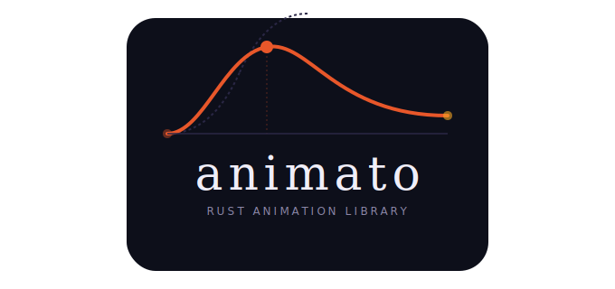

<div align="center">
  
</div>

> *Italian: animato — animated, lively, with life and movement.*

[](https://crates.io/crates/animato)
[](https://docs.rs/animato)
[](https://github.com/AarambhDevHub/animato/actions)
[](#license)

# Animato

Animato is a stable, renderer-agnostic animation toolkit for Rust. It computes
animated values and leaves rendering to your app, engine, terminal UI, browser,
or embedded target.

The v1.0.0 API is stable. The current public crates cover easing, tweens,
timelines, springs, motion paths, input physics, perceptual color interpolation,
drivers, GPU batch evaluation, Bevy integration, and WASM/browser helpers.

## Install

Most applications use the facade crate:

```toml
[dependencies]
animato = "1.0"
```

Enable only the integrations you need:

```toml
[dependencies]
animato = { version = "1.0", features = ["path", "physics", "color"] }
```

For `no_std`, depend on the focused crates directly:

```toml
[dependencies]
animato-core    = { version = "1.0", default-features = false }
animato-tween   = { version = "1.0", default-features = false }
animato-spring  = { version = "1.0", default-features = false }
animato-path    = { version = "1.0", default-features = false }
animato-physics = { version = "1.0", default-features = false }
animato-color   = { version = "1.0", default-features = false }
```

## Quick Start

```rust
use animato::{Easing, Tween, Update};

let mut tween = Tween::new(0.0_f32, 100.0)
    .duration(1.0)
    .easing(Easing::EaseOutCubic)
    .build();

tween.update(0.5);
assert!(tween.value() > 50.0);

tween.update(0.5);
assert_eq!(tween.value(), 100.0);
assert!(tween.is_complete());
```

## Core Concepts

Animato is built around four small traits:

| Trait | Purpose |
|-------|---------|
| `Interpolate` | Defines how a value lerps between two values. |
| `Animatable` | Blanket marker for values that can be animated. |
| `Update` | Advances animation state by a `dt` in seconds. |
| `Playable` | Object-safe animation interface used by timelines. |

The hot path is intentionally simple:

```rust
animation.update(dt);
let value = animation.value();
```

Animato never renders. Your application reads the computed value and applies it
to a UI widget, game transform, DOM style, terminal cell, shader input, or any
other target.

## Crates

| Crate | Purpose | `no_std` |
|-------|---------|----------|
| [`animato-core`](./crates/animato-core) | Traits, interpolation, easing functions | yes |
| [`animato-tween`](./crates/animato-tween) | `Tween<T>`, keyframes, looping, modifiers | yes |
| [`animato-timeline`](./crates/animato-timeline) | Timelines, sequences, staggered starts | std |
| [`animato-spring`](./crates/animato-spring) | 1D and component springs | yes |
| [`animato-path`](./crates/animato-path) | Bezier, SVG paths, motion paths, morphing | yes/core |
| [`animato-physics`](./crates/animato-physics) | Inertia, drag tracking, gestures | yes/core |
| [`animato-color`](./crates/animato-color) | Lab, Oklch, and linear color interpolation | yes |
| [`animato-driver`](./crates/animato-driver) | Animation driver, clocks, scroll driver | std |
| [`animato-gpu`](./crates/animato-gpu) | Batched `Tween<f32>` evaluation with CPU fallback | std |
| [`animato-bevy`](./crates/animato-bevy) | Bevy ECS components, systems, completion messages | std |
| [`animato-wasm`](./crates/animato-wasm) | rAF driver and optional DOM helpers | wasm/std |
| [`animato`](./crates/animato) | Facade crate re-exporting stable APIs | feature gated |

## Feature Flags

| Feature | What it adds |
|---------|--------------|
| `default` | `std`, `tween`, `timeline`, `spring`, `driver` |
| `std` | Hosted functionality, wall clock, heap-backed helpers |
| `tween` | `Tween<T>`, `KeyframeTrack<T>`, `Loop`, `TweenState` |
| `timeline` | `Timeline`, `Sequence`, `stagger`, timeline callbacks |
| `spring` | `Spring`, `SpringN<T>`, `SpringConfig` presets |
| `path` | Bezier curves, SVG parser, motion paths, morphing, draw helpers |
| `physics` | `Inertia`, `DragState`, `GestureRecognizer` |
| `color` | `InLab<C>`, `InOklch<C>`, `InLinear<C>`, `palette` re-export |
| `driver` | `AnimationDriver`, clocks, `ScrollDriver`, `ScrollClock` |
| `gpu` | `GpuAnimationBatch` through `wgpu` with CPU fallback |
| `bevy` | `AnimatoPlugin`, tween/spring components, transform helpers |
| `wasm` | `RafDriver`, `ScrollSmoother` |
| `wasm-dom` | FLIP, split text, drag, observer, shared-element helpers |
| `serde` | Serialization for supported public types |
| `tokio` | `Timeline::wait()` async completion helper |

## Examples

```sh
cargo run --example basic_tween
cargo run --example spring_demo
cargo run --example keyframe_track
cargo run --example timeline_sequence
cargo run --example motion_path --features path
cargo run --example morph_path --features path
cargo run --example scroll_linked --features driver
cargo run --example physics_drag --features physics
cargo run --example color_animation --features color
cargo run --example gpu_particles --features gpu
cargo run --example bevy_transform --features bevy
cargo run --example tui_progress
cargo run --example tui_spinner
```

WASM example:

```sh
cd examples/wasm_counter
wasm-pack build --target web
```

## Documentation

The v1.0 documentation lives in [`docs/`](./docs/):

| Start here | Details |
|------------|---------|
| [Getting Started](./docs/getting-started.md) | First animation and update loop. |
| [API Full](./docs/api-full.md) | Complete stable API map by crate. |
| [Feature Flags](./docs/feature-flags.md) | Exact feature requirements. |
| [Concepts](./docs/concepts.md) | `Interpolate`, `Update`, clocks, composition. |
| [Recipes](./docs/recipes.md) | Practical patterns for UI, games, paths, and input. |
| [Testing](./docs/testing.md) | Local and CI verification commands. |
| [Release](./docs/release.md) | v1.0 publishing checklist. |

The generated Rust API docs are available on
[docs.rs/animato](https://docs.rs/animato).

## Testing

The v1.0 release gate is:

```sh
cargo fmt --check
cargo clippy --workspace --all-features -- -D warnings
cargo test --workspace --all-features
cargo test --workspace --no-default-features
cargo test -p animato --all-features --examples
cargo doc --workspace --all-features --no-deps
cargo check -p animato-wasm --target wasm32-unknown-unknown --features wasm-dom
cargo bench --workspace --no-run
```

Coverage and fuzzing are part of the stable release workflow when the tools are
installed:

```sh
cargo llvm-cov --workspace --all-features --fail-under-lines 90
cargo +nightly fuzz run svg_path_parser -- -max_total_time=60
```

## Stability

Animato follows Semantic Versioning. Starting at `1.0.0`, public APIs are
treated as stable. Breaking changes require a future major release and migration
notes. The focused sub-crates can still be used independently when a project
needs tighter dependency control than the facade provides.

## Project Docs

- [Architecture](./ARCHITECTURE.md)
- [Roadmap](./ROADMAP.md)
- [Changelog](./CHANGELOG.md)
- [Contributing](./CONTRIBUTING.md)
- [Benchmarks](./docs/benchmarks.md)

## Support

- Star the repo on [GitHub](https://github.com/AarambhDevHub/animato)
- Open issues for reproducible bugs and clear feature requests
- Support development through [Buy Me a Coffee](https://buymeacoffee.com/aarambhdevhub)

## License

Licensed under either of:

- [MIT License](./LICENSE-MIT)
- [Apache License, Version 2.0](./LICENSE-APACHE)

at your option.

Unless you explicitly state otherwise, any contribution intentionally submitted
for inclusion in this project is dual-licensed as above, without additional
terms or conditions.
